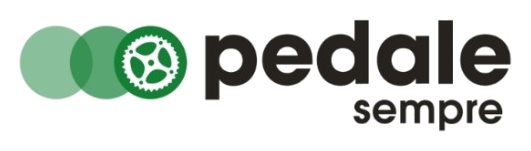

# CLAUDE.md — Pedale Sempre Website

## Visão Geral do Projeto

Site institucional para a **Pedale Sempre**, loja de venda e serviços de bicicletas localizada no Bairro de Fátima, Serra, Espírito Santo, Brasil.

- **Stack**: HTML semântico + CSS puro + JavaScript mínimo (somente quando necessário)
- **Idioma do site**: Português Brasileiro (pt-BR)
- **Objetivo**: Site estático, multi-página, otimizado para SEO
- **Fonte do protótipo**: Um único `index.html` (SPA simulada) que DEVE ser convertido em múltiplas páginas HTML independentes

---

## Estrutura de Páginas

O protótipo original é um SPA simulada com `<div class="page" id="page-xxx">`. Cada uma dessas divs deve se tornar uma página HTML independente:

| Página | Arquivo | Origem no protótipo (`id`) |
|---|---|---|
| Home | `index.html` | `page-home` |
| Produtos | `produtos.html` | `page-produtos` |
| Serviços | `servicos.html` | `page-servicos` |
| Sobre Nós | `sobre.html` | `page-sobre` |
| Blog | `blog.html` | `page-blog` |
| Artigo 1 — 5 Acessórios Essenciais para Pedalar em Segurança | `blog/acessorios-essenciais-pedalar-seguranca.html` | `page-artigo1` |
| Artigo 2 — A Importância dos Equipamentos de Proteção | `blog/importancia-equipamentos-protecao.html` | `page-artigo2` |
| Artigo 3 — Dicas para Pedalar com Segurança na Ciclovia | `blog/dicas-pedalar-seguranca-ciclovia.html` | `page-artigo3` |
| Artigo 4 — Curiosidades da Mountain Bike que Você Não Sabia | `blog/curiosidades-mountain-bike.html` | `page-artigo4` |
| Artigo 5 — Curiosidades da Bicicleta Urbana | `blog/curiosidades-bicicleta-urbana.html` | `page-artigo5` |
| Artigo 6 — E-Bikes na Ciclovia: O Que Você Precisa Saber | `blog/ebikes-ciclovia.html` | `page-artigo6` |
| Contato | `contato.html` | `page-contato` |

### Diretório de Artigos do Blog

Todos os artigos do blog ficam em `/blog/`. Os nomes dos arquivos devem ser slugs SEO-friendly derivados dos títulos (conforme tabela acima).

---

## Estrutura de Diretórios

```
pedalesempre/
├── index.html
├── produtos.html
├── servicos.html
├── sobre.html
├── blog.html
├── contato.html
├── blog/
│   ├── acessorios-essenciais-pedalar-seguranca.html
│   ├── importancia-equipamentos-protecao.html
│   ├── dicas-pedalar-seguranca-ciclovia.html
│   ├── curiosidades-mountain-bike.html
│   ├── curiosidades-bicicleta-urbana.html
│   └── ebikes-ciclovia.html
├── css/
│   ├── global.css          # Reset, variáveis, tipografia, utilitários, botões
│   ├── header.css          # Header fixo + navegação + hamburger mobile
│   ├── footer.css          # Footer + WhatsApp float
│   ├── home.css            # Hero, highlights, services-preview, about-preview, blog-preview, CTA
│   ├── produtos.css        # Filter bar + products grid
│   ├── servicos.css        # Accordions + service tables + service notes
│   ├── sobre.css           # About grid + values + brands
│   ├── blog.css            # Blog page grid + blog full cards
│   ├── artigo.css          # Article page layout + article content
│   ├── contato.css         # Contact form + contact info cards + map placeholder
│   └── responsive.css      # TODOS os media queries consolidados
├── js/
│   └── main.js             # Accordion, filtro de produtos, hamburger menu
└── assets/
    ├── hero-image.png
    ├── logo.png
    ├── logocircles.png
    ├── icon-bicicletas.jpg
    ├── icon-servicos.jpg
    ├── icon-clientes.jpg
    ├── icon-ofertas.jpg
    ├── icon-promocoes.jpg
    ├── entrada-loja-fisica.png
    ├── pedale-sempre-facebook.png
    ├── pedale-sempre-instagram.png
    ├── blog-01-article-page-01.jpg
    ├── ... (demais imagens de blog e serviços)
    ├── pagina-servicos-01.jpg
    └── ... (até pagina-servicos-08.jpg)
```

---

## Organização dos CSS

### Princípio: máxima reutilização

Extrair do protótipo monolítico (`<style>` do `index.html`) para arquivos CSS separados. Cada página importa apenas o CSS que precisa. Os CSS comuns são compartilhados.

### `global.css` — Obrigatório em TODAS as páginas

Contém:
- CSS Reset (`*, html, body`)
- CSS Custom Properties (variáveis `:root`)
- Tipografia base (fontes, body)
- Classes utilitárias reutilizadas em múltiplas páginas: `.section`, `.section-inner`, `.section-alt`, `.section-green`, `.section-title`, `.section-subtitle`, `.section-header`
- Botões: `.btn`, `.btn-white`, `.btn-outline`, `.btn-black`, `.btn-outline-dark`, `.btn-green`
- `.highlight-label` e `.highlight`
- `.page-hero` (hero genérico usado em Produtos, Serviços, Sobre, Blog, Contato)
- `.stats`, `.stat`, `.stat-number`, `.stat-label`

### CSS Variables (`:root`)

```css
:root {
    --green-primary: #2D7A3A;
    --green-dark: #1E5C28;
    --green-light: #E8F5EA;
    --green-accent: #4CAF50;
    --black: #2A2A2A;
    --white: #FFFFFF;
    --gray-light: #F5F5F5;
    --gray-mid: #E0E0E0;
    --gray-text: #777777;
    --font-display: 'Archivo Black', sans-serif;
    --font-body: 'DM Sans', sans-serif;
    --max-width: 1200px;
    --header-height: 70px;
}
```

### Inclusão de CSS por página

| Página | CSS incluídos (em ordem) |
|---|---|
| Home (`index.html`) | `global.css`, `header.css`, `home.css`, `footer.css`, `responsive.css` |
| Produtos | `global.css`, `header.css`, `produtos.css`, `footer.css`, `responsive.css` |
| Serviços | `global.css`, `header.css`, `servicos.css`, `footer.css`, `responsive.css` |
| Sobre Nós | `global.css`, `header.css`, `sobre.css`, `footer.css`, `responsive.css` |
| Blog | `global.css`, `header.css`, `blog.css`, `footer.css`, `responsive.css` |
| Artigos | `global.css`, `header.css`, `artigo.css`, `footer.css`, `responsive.css` |
| Contato | `global.css`, `header.css`, `contato.css`, `footer.css`, `responsive.css` |

### `responsive.css` — Media queries consolidados

Consolidar TODOS os breakpoints do protótipo em um único arquivo:
- `@media (max-width: 1024px)` — Tablet
- `@media (max-width: 768px)` — Mobile (inclui navegação hamburger)
- `@media (max-width: 480px)` — Small mobile

O `responsive.css` deve incluir regras de responsividade para TODOS os componentes de todas as páginas, organizado por breakpoint.

---

## Navegação — Migração de onclick para href

### TAREFA CRÍTICA

No protótipo original, **toda** a navegação usa `onclick="navigate('xxx')"` com `href="javascript:void(0)"`. Isso DEVE ser substituído por links `<a href="...">` reais.

### Mapeamento de navegação

| Protótipo (`onclick`) | Link real (`href`) |
|---|---|
| `navigate('home')` | `index.html` ou `/` |
| `navigate('produtos')` | `produtos.html` |
| `navigate('servicos')` | `servicos.html` |
| `navigate('sobre')` | `sobre.html` |
| `navigate('blog')` | `blog.html` |
| `navigate('contato')` | `contato.html` |
| `navigate('artigo1')` | `blog/acessorios-essenciais-pedalar-seguranca.html` |
| `navigate('artigo2')` | `blog/importancia-equipamentos-protecao.html` |
| `navigate('artigo3')` | `blog/dicas-pedalar-seguranca-ciclovia.html` |
| `navigate('artigo4')` | `blog/curiosidades-mountain-bike.html` |
| `navigate('artigo5')` | `blog/curiosidades-bicicleta-urbana.html` |
| `navigate('artigo6')` | `blog/ebikes-ciclovia.html` |

### Caminhos relativos nos artigos

As páginas de artigos ficam em `/blog/`, então os links relativos devem subir um nível:
- Header/footer links: `../index.html`, `../produtos.html`, etc.
- Assets: `../assets/logo.png`, `../assets/...`
- CSS: `../css/global.css`, etc.
- Link "← Voltar para o Blog": `../blog.html`

### Header — Estado ativo na navegação

Cada página deve marcar o link ativo correspondente no header com a classe `active`. Exemplo na página de Produtos:

```html
<nav>
    <a href="index.html" class="nav-link">Home</a>
    <a href="produtos.html" class="nav-link active">Produtos</a>
    <a href="servicos.html" class="nav-link">Serviços</a>
    <a href="sobre.html" class="nav-link">Sobre Nós</a>
    <a href="blog.html" class="nav-link">Blog</a>
    <a href="contato.html" class="nav-link">Contato</a>
</nav>
```

Nas páginas de artigos do blog, o link "Blog" deve estar ativo.

---

## JavaScript — Uso Mínimo

O site usa JavaScript SOMENTE para interações que não podem ser feitas com HTML/CSS puro:

### `js/main.js`

1. **Hamburger menu** — Toggle da nav mobile (abrir/fechar)
2. **Accordion** — Abrir/fechar os accordions na página de Serviços
3. **Filtro de produtos** — Mostrar/esconder cards por categoria na página de Produtos

### Remover do protótipo

- Remover a função `window.navigate()` — não é mais necessária (links reais)
- Remover todos os `onclick="navigate(...)"` dos links
- Remover `.page { display: none; }` e `.page.active { display: block; }` — não há mais SPA

### Manter/adaptar

- `toggleMenu()` — Menu hamburger mobile
- `toggleAccordion(el)` — Accordion de serviços
- `filterProducts(btn, category)` — Filtro na página de produtos

---

## SEO — Requisitos

### HTML Semântico obrigatório

Cada página DEVE usar tags semânticas corretas:

```html
<!DOCTYPE html>
<html lang="pt-BR">
<head>
    <meta charset="UTF-8">
    <meta name="viewport" content="width=device-width, initial-scale=1.0">
    <meta name="description" content="[Descrição única por página, 150-160 chars]">
    <meta name="robots" content="index, follow">
    <link rel="canonical" href="https://www.pedalesempre.com.br/[pagina].html">
    <title>[Título da Página] | Pedale Sempre</title>
    <!-- Open Graph -->
    <meta property="og:title" content="[Título]">
    <meta property="og:description" content="[Descrição]">
    <meta property="og:type" content="website">
    <meta property="og:url" content="https://www.pedalesempre.com.br/[pagina].html">
    <meta property="og:image" content="https://www.pedalesempre.com.br/assets/logo.png">
    <meta property="og:locale" content="pt_BR">
    <!-- Fontes -->
    <link rel="preconnect" href="https://fonts.googleapis.com">
    <link href="https://fonts.googleapis.com/css2?family=Archivo+Black&family=DM+Sans:ital,wght@0,300;0,400;0,500;0,600;0,700;1,400&display=swap" rel="stylesheet">
    <!-- CSS -->
    <link rel="stylesheet" href="css/global.css">
    <link rel="stylesheet" href="css/header.css">
    <!-- [CSS específico da página] -->
    <link rel="stylesheet" href="css/footer.css">
    <link rel="stylesheet" href="css/responsive.css">
</head>
```

### Estrutura semântica do body

```html
<body>
    <header>...</header>
    <main>
        <!-- Conteúdo específico da página -->
        <section>...</section>
    </main>
    <footer>...</footer>
</body>
```

- Usar `<header>` para o header fixo
- Usar `<main>` para o conteúdo principal (NÃO existe no protótipo — ADICIONAR)
- Usar `<section>` com atributos descritivos para as seções
- Usar `<nav>` para navegação
- Usar `<article>` para artigos do blog
- Usar `<aside>` quando aplicável
- Usar `<footer>` para o footer
- Usar `<figure>` e `<figcaption>` para imagens com legenda
- Usar heading hierarchy correta: um único `<h1>` por página, seguido de `<h2>`, `<h3>`, etc.

### Meta descriptions por página

| Página | Title | Meta Description |
|---|---|---|
| Home | `Pedale Sempre - Bicicletas e Serviços em Serra, ES` | `Pedale Sempre - Venda, manutenção e serviços especializados em bicicletas em Serra, ES. Mais de 3.000 clientes satisfeitos. Visite nossa loja!` |
| Produtos | `Produtos - Bicicletas, E-Bikes, Acessórios e Peças \| Pedale Sempre` | `Confira bicicletas mountain bike, e-bikes, acessórios e peças das melhores marcas: GIOS, MAZZA, SHIMANO, Absolute e mais. Pedale Sempre, Serra-ES.` |
| Serviços | `Serviços de Manutenção e Revisão de Bicicletas \| Pedale Sempre` | `Montagem, revisão, regulagem de freios, câmbios, suspensão e serviços para e-bikes. Preços acessíveis e produtos biodegradáveis. Serra-ES.` |
| Sobre Nós | `Sobre Nós - Conheça a Pedale Sempre \| Serra, ES` | `Conheça a história da Pedale Sempre. Mais que uma loja, um incentivo ao ciclismo. Atendimento personalizado em Serra, Espírito Santo.` |
| Blog | `Blog - Dicas e Curiosidades sobre Bicicletas \| Pedale Sempre` | `Dicas de segurança, curiosidades sobre mountain bike, e-bikes, bicicleta urbana e muito mais no blog da Pedale Sempre.` |
| Contato | `Contato - Fale Conosco \| Pedale Sempre` | `Entre em contato com a Pedale Sempre. Telefone (027) 3337-7014, WhatsApp, e-mail ou visite-nos na Av. José Moreira Martins Rato, Serra-ES.` |

Para artigos, usar o título do artigo como `<title>` e um resumo de ~155 chars como `meta description`.

### Artigos — Marcação `<article>` e Schema.org

Cada página de artigo do blog deve usar:

```html
<main>
    <article itemscope itemtype="https://schema.org/BlogPosting">
        <meta itemprop="author" content="Pedale Sempre">
        <meta itemprop="publisher" content="Pedale Sempre">
        <a href="../blog.html">← Voltar para o Blog</a>
        <span itemprop="articleSection">[Tag]</span>
        <h1 itemprop="headline">[Título do artigo]</h1>
        <p itemprop="description">[Resumo]</p>
        
        <div itemprop="articleBody">
            [Conteúdo do artigo]
        </div>
    </article>
</main>
```

### Imagens — Atributos obrigatórios

Toda `` DEVE ter:
- `alt` descritivo e em português
- `width` e `height` para evitar CLS (Cumulative Layout Shift)
- `loading="lazy"` para imagens abaixo do fold

### Schema.org — LocalBusiness (Home page)

Adicionar no `<head>` da home page:

```html
<script type="application/ld+json">
{
    "@context": "https://schema.org",
    "@type": "LocalBusiness",
    "name": "Pedale Sempre",
    "description": "Venda, manutenção e serviços especializados em bicicletas",
    "url": "https://www.pedalesempre.com.br",
    "telephone": "+55-27-3337-7014",
    "email": "pedalesempre@gmail.com",
    "address": {
        "@type": "PostalAddress",
        "streetAddress": "Av. José Moreira Martins Rato, 540",
        "addressLocality": "Serra",
        "addressRegion": "ES",
        "postalCode": "29160-790",
        "addressCountry": "BR"
    },
    "openingHours": [
        "Mo-Fr 08:00-18:00",
        "Sa 08:00-13:00"
    ],
    "sameAs": [
        "https://www.instagram.com/pedalesempre",
        "https://www.facebook.com/pedalesempre"
    ]
}
</script>
```

---

## Assets — Mapeamento de Nomes

Os arquivos de assets no projeto têm nomes sem hífens. Para o site final, usar nomes com hífens (kebab-case) para consistência e SEO de URLs.

### Mapeamento de renomeação

| Arquivo original (projeto) | Nome final (assets/) |
|---|---|
| `logo.png` | `logo.png` |
| `logocircles.png` | `logocircles.png` |
| `hero-image.png` | `hero-image.png` |
| `servicos.jpg` | `icon-servicos.jpg` |
| `bicicletas.jpg` | `icon-bicicletas.jpg` |
| `clientes.jpg` | `icon-clientes.jpg` |
| `ofertas.jpg` | `icon-ofertas.jpg` |
| `promocoes.jpg` | `icon-promocoes.jpg` |
| `entradalojafisica.png` | `entrada-loja-fisica.png` |
| `pedalesemprefacebook.png` | `pedale-sempre-facebook.png` |
| `pedalesempreinstagram.png` | `pedale-sempre-instagram.png` |
| `blog01articlepage01.jpg` | `blog-01-article-page-01.jpg` |
| `blog01articlepage02.jpg` | `blog-01-article-page-02.jpg` |
| `...` (padrão similar) | `blog-XX-article-page-YY.jpg` |
| `paginaservicos01.jpg` | `pagina-servicos-01.jpg` |
| `...` (padrão similar) | `pagina-servicos-XX.jpg` |

### Mapeamento de artigos → imagens de capa

| Artigo | Imagem de capa (cover) |
|---|---|
| Artigo 1 — 5 Acessórios Essenciais | `blog-02-article-page-01.jpg` |
| Artigo 2 — Equipamentos de Proteção | `blog-04-article-page-01.jpg` |
| Artigo 3 — Segurança na Ciclovia | `blog-03-article-page-01.jpg` |
| Artigo 4 — Curiosidades Mountain Bike | `blog-06-article-page-01.jpg` |
| Artigo 5 — Bicicleta Urbana | `blog-05-article-page-01.jpg` |
| Artigo 6 — E-Bikes na Ciclovia | `blog-01-article-page-01.jpg` |

---

## Componentes Compartilhados

### Header (todas as páginas)

O header é idêntico em todas as páginas, só muda a classe `active` no link correspondente.

```html
<header>
    <div class="header-inner">
        <a href="index.html" class="header-logo">
            
        </a>
        <button class="hamburger" aria-label="Menu" aria-expanded="false">
            <span></span><span></span><span></span>
        </button>
        <nav id="mainNav" aria-label="Navegação principal">
            <a href="index.html" class="nav-link [active se home]">Home</a>
            <a href="produtos.html" class="nav-link [active se produtos]">Produtos</a>
            <a href="servicos.html" class="nav-link [active se servicos]">Serviços</a>
            <a href="sobre.html" class="nav-link [active se sobre]">Sobre Nós</a>
            <a href="blog.html" class="nav-link [active se blog/artigo]">Blog</a>
            <a href="contato.html" class="nav-link [active se contato]">Contato</a>
        </nav>
    </div>
</header>
```

**Nota para artigos (`/blog/*.html`)**: todos os `href` devem ter `../` prefixado.

**Nota de acessibilidade**: O hamburger DEVE ser um `<button>` (não `<div>`) com `aria-label` e `aria-expanded`.

### Footer (todas as páginas)

O footer é idêntico em todas as páginas. Contém:
- Logo + slogan
- Links de navegação (mesmos caminhos do header)
- Links de serviços (todos apontam para `servicos.html`)
- Informações de contato (telefone, e-mail, redes sociais)
- Copyright
- Redes sociais: Instagram (@pedalesempre), Facebook

### WhatsApp Float (todas as páginas)

Botão fixo no canto inferior direito com link para `https://wa.me/552733377014`.

---

## Informações do Negócio

| Campo | Valor |
|---|---|
| Nome | Pedale Sempre |
| Slogan | Mais que um nome, um incentivo! |
| Endereço | Av. José Moreira Martins Rato, 540, Bairro de Fátima, Serra, ES, CEP 29160-790 |
| Telefone | (027) 3337-7014 |
| WhatsApp | (027) 3337-7014 |
| E-mail | pedalesempre@gmail.com |
| Instagram | @pedalesempre |
| Facebook | Pedale Sempre |
| Horário | Seg–Sex: 8h às 18h, Sábado: 8h às 13h |
| Marcas | GIOS, MAZZA, PRO-X, STREET GO, SHIMANO, ABSOLUTE |
| Cartões | Visa, MasterCard, Elo, American Express, Hipercard |
| Diferencial | Produtos biodegradáveis na limpeza de bikes e peças |
| Clientes atendidos | 3.000+ |

---

## Fontes

Google Fonts, carregadas via `<link>`:
- **Archivo Black** — Títulos display (hero overlay text)
- **DM Sans** — Corpo do texto, headings de seção, botões (pesos: 300, 400, 500, 600, 700, 400i)

---

## Detalhes de Implementação Importantes

### 1. E-mail ofuscado

O e-mail no protótipo usa HTML entities para proteção contra spam. Manter essa ofuscação:
```html
&#112;&#101;&#100;&#97;&#108;&#101;&#115;&#101;&#109;&#112;&#114;&#101;&#64;&#103;&#109;&#97;&#105;&#108;&#46;&#99;&#111;&#109;
```

### 2. Formulário de contato

O formulário na página de contato é apenas visual no momento (ação `event.preventDefault()` com alert de protótipo). Campos:
- Nome completo (text)
- E-mail (email)
- Telefone (tel) — Placeholder: (27) 99999-9999
- Assunto (select): Orçamento de serviço, Informação sobre produtos, Dúvida geral, Outro
- Mensagem (textarea)
- Botão: "Enviar Mensagem"

### 3. Page hero com fundo diagonal

As páginas internas (Produtos, Serviços, Sobre, Blog, Contato) usam `.page-hero` com fundo verde e padrão diagonal em CSS (pseudo-element `::before` com `repeating-linear-gradient`).

### 4. Seção verde com fundo texturizado

A seção `.section-green` (preview de serviços na Home) usa:
- Fundo `--green-primary`
- Padrão diagonal listrado via `::before`
- Texto grande decorativo "SERVIÇOS" via `::after`

### 5. Hero da Home

O hero da home page tem:
- Imagem de fundo (`hero-image.png` — placeholder)
- Overlay gradiente verde (esquerda opaco → direita transparente)
- Texto decorativo vertical "PEDALE SEMPRE" rotacionado
- Círculos decorativos via `::before` e `::after`
- A imagem `hero-image.png` já existe no projeto e deve ser utilizada como background do hero

### 6. Accordion na página de serviços

Os serviços usam accordions com as seguintes categorias:
1. Montagem de Bike Nova (aberto por padrão — classe `open`)
2. Rodas
3. Limpeza e Manutenção de Suspensão
4. Regulagem de Freios
5. Revisões (7 tipos de revisão)
6. Câmbios
7. Serviços Especiais
8. Instalação de Peças Avulsas

Cada accordion tem uma tabela com nome do serviço, descrição e preço.

### 7. Filtro de produtos

A página de produtos tem botões de filtro por categoria:
- Todos
- Bicicletas
- E-Bikes
- Acessórios
- Peças

Os product cards têm `data-category` para filtragem via JS.

### 8. Mapa na página de contato

Atualmente é um placeholder (`📍 Mapa — Google Maps Embed`). No futuro, substituir por um `<iframe>` do Google Maps com a localização da loja.

---

## Checklist de Conversão (Protótipo → Multi-página)

- [ ] Criar estrutura de diretórios (`css/`, `js/`, `assets/`, `blog/`)
- [ ] Renomear e copiar todos os assets com nomenclatura kebab-case
- [ ] Extrair CSS do `<style>` monolítico para arquivos separados conforme tabela
- [ ] Criar `global.css` com reset, variáveis, tipografia e componentes compartilhados
- [ ] Criar `header.css` e `footer.css`
- [ ] Criar CSS específico para cada página
- [ ] Consolidar todos os media queries em `responsive.css`
- [ ] Criar cada página HTML com `<head>` completo (meta tags SEO, Open Graph, canonical)
- [ ] Adicionar `<main>` envolvendo o conteúdo em cada página
- [ ] Substituir TODOS os `onclick="navigate(...)"` por `href` real
- [ ] Substituir TODOS os `href="javascript:void(0)"` por URLs reais
- [ ] Ajustar caminhos relativos para páginas em `/blog/` (prefixar `../`)
- [ ] Definir classe `active` no link de navegação correto em cada página
- [ ] Converter hamburger de `<div onclick>` para `<button>` com `aria-label`
- [ ] Adicionar `<article>` + Schema.org nos artigos do blog
- [ ] Adicionar Schema.org `LocalBusiness` na home page
- [ ] Adicionar `alt`, `width`, `height` e `loading="lazy"` em todas as imagens
- [ ] Adicionar favicon
- [ ] Remover CSS de SPA: `.page { display: none; }` e `.page.active { display: block; }`
- [ ] Remover função `window.navigate()` do JavaScript
- [ ] Manter e adaptar `toggleMenu()`, `toggleAccordion()`, `filterProducts()` em `main.js`
- [ ] Verificar heading hierarchy (um único `<h1>` por página)
- [ ] Testar navegação em todas as páginas e artigos
- [ ] Testar responsividade em todos os breakpoints (1024px, 768px, 480px)

---

## Diretrizes de Código

### HTML
- Indentação: 4 espaços
- Usar tags semânticas (section, article, nav, main, header, footer, figure)
- Um único `<h1>` por página
- Atributo `lang="pt-BR"` no `<html>`
- Todos os formulários devem ter `<label>` associados aos inputs

### CSS
- Usar CSS custom properties (variáveis) definidas em `:root`
- Não usar `!important` (exceto se absolutamente necessário)
- Organizar propriedades: posicionamento → display/box model → tipografia → visual → animação
- Comentários de seção com `/* ===== NOME ===== */`

### JavaScript
- Vanilla JS, sem frameworks/bibliotecas
- `'use strict';` no topo
- Event delegation quando possível
- Mínimo necessário: accordion, filtro, hamburger menu

### Acessibilidade
- Hamburger: `<button>` com `aria-label="Menu"` e `aria-expanded`
- Nav: `aria-label="Navegação principal"`
- Imagens: `alt` descritivo
- Contraste: verificar que text/background mantém ratio WCAG AA
- Focus visible: manter estilos de foco para navegação por teclado

---

## Git — Convenção de Commits

O repositório git está na pasta pai (`prototypes/`) e é compartilhado com outros projetos. Todos os commits deste projeto DEVEM usar o prefixo `pedalesempre:` para facilitar a identificação no histórico.

Formato: `pedalesempre: <descrição curta da mudança>`

Exemplos:
- `pedalesempre: setup inicial de diretórios e assets`
- `pedalesempre: extrai CSS global e variáveis`
- `pedalesempre: cria página de produtos com links reais`
- `pedalesempre: adiciona Schema.org na home page`

---

## Deploy

O site será hospedado como site estático. Opções planejadas:
- **Cloudflare Pages**, **Netlify** ou **Vercel** (hosting gratuito)
- Domínio: registrar via Registro.br (`.com.br`)
- Sem backend/servidor necessário
- O formulário de contato poderá integrar com serviço externo no futuro (ex: Formspree, Netlify Forms)
